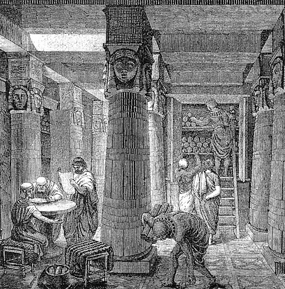

## Welcome to Alexandria

Alexandria is a project to enable anyone to search for books in the net, and if necessary save his/her preferences locally for future reference.

### A Brief History

The great **library of Alexandria**, located in modern-day Alexandria, Egypt, was one of the largest libraries of the ancient world. It is said that during its hey day the library used to host around 400,000 scrolls.
While the ancient times have come and gone, humanity's quest for knowledge is still far from over. But today there are more elegant and efficient ways to search for book, sitting at the comfort of our home.
We can browse and look for books, make notes, tag them, and keep for future reference as book-marks, thanks to technologies made available.

Project Alexandria is a small show-case of such capabilities of the modern technologies, with a tribute to its much richer and greater ancestor.

### Core Functionalities

At basic level, Alexandria provides
- A set of APIs (based on python `FastAPI`) to google for books, based on author names, genre, ISBN ID etc.
- Each Book does have International Standard Book Number which abbreviates to ISBN. ISBNs were 10 digits in length up to the end of December 2006, but since 1 January 2007 they now always consist of 13 digits. ISBNs are calculated using a specific mathematical formula and include a check digit to validate the number.
- A local database running behind the scene, which may be used to stored some meta data about the search results, with necessary notes/tagging
- The APIs as well as the underlying database are spun up as docker containers so that it may be run anywhere by the user
- In future this may also be extended to have a formal UI where user may navigate and do the same steps, in a more friendlier way

### APIs available for Books

You can perform basic CURD operations on the Book details through this project
To know more about the services, go to our Services README [click on](https://github.com/arnab-chanda/alexandria/blob/master/services/README.md).

### Underlying Technologies/References

1. For details on how to use _Google Books API_, [check out the documentation](https://developers.google.com/books/docs/v1/using).
2. For details on how _FastAPI_ works, [check out the documentation](https://fastapi.tiangolo.com).

#### Below are some of the sample genre Books that you can know more about through the APIs

#### Historical :
Something Red
Miss Cameron's Fall from Grace
Ruth's Journey
The Freedom House
The Dark Room
Lucky Billy
Rainbows on the Moon
Black Mountain

#### Motivational :
Consider a Greater Purpose
Chocolate for a Mother's Heart
I'll Walk with You

#### Inspirational:
Cyndy's Blessed Assurance
His Precious Inheritance
The Texas Ranger's Secret
Rocky Mountain Dreams
The Negotiator
Second Chance Hero
The Baby Barter
